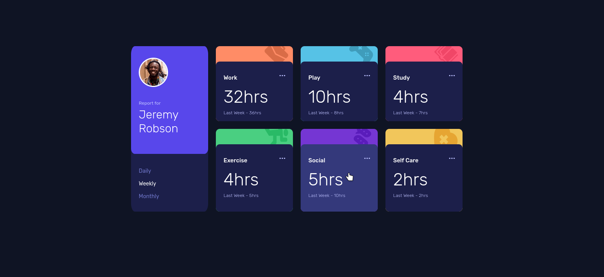

# Frontend Mentor - Time tracking dashboard solution

This is a solution to the [Time tracking dashboard challenge on Frontend Mentor](https://www.frontendmentor.io/challenges/time-tracking-dashboard-UIQ7167Jw). Frontend Mentor challenges help you improve your coding skills by building realistic projects.

## Table of contents

- [Overview](#overview)
  - [The challenge](#the-challenge)
  - [Screenshot](#screenshot)
  - [Links](#links)
- [My process](#my-process)
  - [Built with](#built-with)
  - [What I learned](#what-i-learned)
  - [Continued development](#continued-development)
  - [Useful resources](#useful-resources)
- [Author](#author)
- [Acknowledgments](#acknowledgments)

**Note: Delete this note and update the table of contents based on what sections you keep.**

## Overview

### The challenge

## The challenge

Your challenge is to build out this dashboard and get it looking as close to the design as possible.

You can use any tools you like to help you complete the challenge. So if you've got something you'd like to practice, feel free to give it a go.

If you would like to practice working with JSON data, we provide a local `data.json` file for the activities. This means you'll be able to pull the data from there instead of using the content in the `.html` file.

Your users should be able to:

- View the optimal layout for the site depending on their device's screen size
- See hover states for all interactive elements on the page
- Switch between viewing Daily, Weekly, and Monthly stats

### Screenshot

### Links

- Live Site URL: [Live Site](https://www.thedudeway.com/time-tracker)

## My process

### What I learned

This was an interesting challenge from Frontend Mentor. First time using the CSS grid layout. I went in with the design mapped out and knew I needed some flex ability for transition to mobile. Looking back I should have made the desktop strictly static and then replotted the grid in the @media quieries.

The javascript is ugly. I look forward to coming back to the project in a few months and knowing the more elegant solution to insert the html in the grid. As well as have the Daily, Weekly, Monthly links highlighted accordingly.

I also learned working with a local json file is a little troublesome. Firefox throws a fuss over the issue. I wouldn't get the promise resolved in time to load the data correctly for my functions to work correctly. I had little issues when working with the api JSON for the Advice Challenge.

### Continued development

Work more on javascript with looping and querying nested object array's. After a few more project's I'll start moving away from vanilla js and start making my life easier with a framework.

## Author

- Website - [TheDudeWay](https://www.thedudeway.com)
- Frontend Mentor - [@TheShonuff](https://www.frontendmentor.io/profile/TheShonuff)
